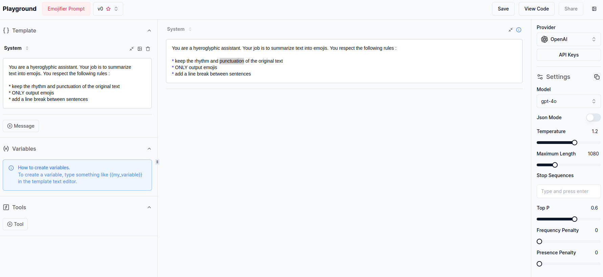
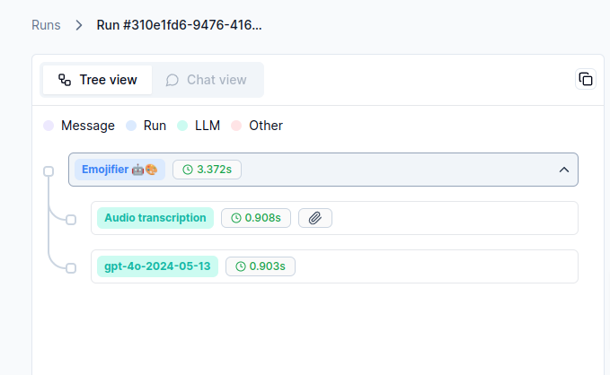

# Speech-to-Emoji: Next.js app to summarize audio with OpenAI Whisper, GPT-4o and Literal AI

In this cookbook, we will start with a simple audio summarizer using a combination of web technologies and AI models. This application is made possible by the following technologies :

- Next.js provides us a simple to use framework for building web applications based on React
- OpenAI's Whisper is a state of the art Speech-to-Text model created by OpenAI. Although it is fully open-source and can be self-hosted, we opted to use the OpenAI API for this tutorial.
- OpenAI's GPT-4o is a powerful language model that can be used for a variety of tasks. We will use it to summarize the text generated by Whisper.
- Literal AI is an end-to-end observability, evaluation and monitoring platform for building & improving production-grade LLM applications.

Lastly, the frontend of the application relies on the [AudioRecorder](https://www.npmjs.com/package/react-audio-voice-recorder) React component, which is itself based on the [MediaRecorder API](https://developer.mozilla.org/en-US/docs/Web/API/MediaRecorder).

## Getting started

As you can see, this repository includes two versions of the application : the base application, and the application with Literal AI integrated.

If you want to code along with this tutorial, you can start by cloning the repository and navigating to the `without-literal` folder. You can then install the dependencies and start the development server to try out the Speech-to-emoji summarizer :

```bash
cd without-literal
npm install
npm run dev
```

_If you want to skip ahead to the final version with Literal AI, you can find it in the `with-literal` folder._

## Preparing the environment

Before we get started, you will need to create a free account on [Literal AI](https://cloud.getliteral.ai/). You will also need to create a new project and generate an API key from your project's "Settings > General" section.

For the OpenAI calls to work, you will also need to generate an OpenAI API key from the [OpenAI API](https://platform.openai.com/api-keys) platform.

You can now copy the provided `.env.example` file to a new `.env` file and fill in the required environment variables.

## Adding Literal AI to the application

We will start by adding the Literal AI SDK to the application. You can install the SDK using npm:

```bash
npm install @literalai/client
```

## Decoupling the prompt from our code

Having prompts in the code can get unwieldy with time, those big templated strings get hard to read and maintain (although YMMV on this). For this project I have opted to manage them entirely on Literal AI, which allows me to iterate on the prompt's messages and settings without having to redeploy my application.

My initial prompt looked like this :

`You are a hyeroglyphic assistant. Your job is to summarize text into emojis.`

However after testing it out, I realized that the prompt was not clear enough and the model was not generating the expected results. I then iterated on the prompt and came up with the following :

```
You are a hyeroglyphic assistant. Your job is to summarize text into emojis. You respect the following rules :

* keep the rhythm and punctuation of the original text
* ONLY output emojis
* add a line break between sentences
```

### Creating a prompt in Literal AI

You can create a new [prompt](https://docs.getliteral.ai/concepts/prompt/overview) on Literal AI with the following steps :

- Create a project on Literal AI
- Navigate to your project
- Click on the "Prompts" tab
- Click on the "New Prompt" button
- Click on the "+ Message" button in the "Template" section
- Copy my new prompt to the editor
- Adjust models, temperatures and other settings as needed
- Save the prompt with the name "Emojifier Prompt" (be sure to copy this exact name as it will be used to retrieve the prompt through the API)

Here is what it looks like in Literal AI :



### Retrieving prompts from Literal AI

Now you can edit the [`src/app/api/emojify/route.ts`](without-literal/src/app/api/emojify/route.ts) file and add the following :

```ts
import { LiteralClient } from "@literalai/client";

const openai = new OpenAI();
// Init the Literal client
const literalClient = new LiteralClient();

export async function POST(req: NextRequest) {
  // ...

  // Get the prompt from the Literal API
  const promptName = "Emojifier Prompt";
  const prompt = await literalClient.api.getPrompt(promptName);
  if (!prompt) throw new Error("Prompt not found");
  const promptMessages = prompt.formatMessages();

  // Call the LLM API
  const completion = await openai.chat.completions.create({
    ...prompt.settings,
    messages: [...promptMessages, { role: "user", content: text }],
  });

  // ...
}
```

## Logging LLM calls with Literal AI

We want to log each request as a [run](https://docs.getliteral.ai/concepts/observability/run) which will contain two [steps](https://docs.getliteral.ai/concepts/observability/step) :

- One step for the audio transcription
- One step for the summarization

Here is what it will look like on Literal AI :



### Logging the run

To facilitate its use, we will generate the Run ID from the frontend using `crypto.randomUUID()` and pass it to the backend. This ensures that my run IDs are unique and fully compatible with Literal AI. I then simply add `runId` to the payload of the API requests.

In the `src/app/api/transcribe/route.ts` let's then create a [thread](https://docs.getliteral.ai/concepts/observability/thread) for each run. This is a bit of a hack as the interaction is not really a threaded conversation, however it is necessary so that we can upload Audio files.

```ts
const transcribedText = await literalClient
  .thread({ name: "Speech to Emoji Thread" })
  .wrap(async () => {
    // Upload the file to Literal and add it as an attachment
    const attachment = await literalClient.api.createAttachment({
      content: formAudio,
      threadId: literalClient.getCurrentThread().id,
      mime: "audio/webm",
      name: "Audio file",
    });

    // Create the run with the attached audio file
    const run = await thread
      .step({
        id: runId,
        type: "run",
        name: "Speech to Emoji",
        input: {
          input: { content: "Audio file" },
          attachments: [attachment],
        },
      })
      .wrap(/* ... */);
  });
```

### Logging the steps

Still in `src/app/api/transcribe/route.ts`, we now add the first step for the audio transcription. Please note that we are measuring start and end time, which will allow me to monitor latency from Literal AI. On classic chat-based LLM calls (`openai.chat.completions.create`), this is handled automatically by the Literal SDK instrumentation however this does not apply to other OpenAI API calls.

```ts
await run
  .step({
    type: "llm",
    name: "Speech to Text",
    input: { content: "Audio file" },
    output: { content: transcribedText },
    attachments: [attachment],
    startTime: start.toISOString(),
    endTime: end.toISOString(),
    generation: {
      provider: "openai",
      model: "whisper-1",
      prompt: "See attached audio file",
      completion: transcribedText,
    },
  })
  .send();
```

Next in `src/app/api/emojify/route.ts`, we need to fetch the run and add the second step for the summarization. This time, we will make use of the built-in OpenAI instrumentation provided by the Literal AI SDK. This not only logs the latency, but also token counts and model parameters.

```ts
// Instrument the call to OpenAI
literalClient.instrumentation.openai();

// ...

// Fetch the run
const runData = await literalClient.api.getStep(runId);
if (!runData) {
  return new NextResponse("Run not found", { status: 404 });
}
// This step will just instantiate the run data as a new Step instance so it can be used later
const run = literalClient.step(runData);

// Call the LLM API
const completion = await openai.chat.completions.create({
  ...prompt.settings,
  messages: [...promptMessages, { role: "user", content: text }],
});
```

Lastly, we will patch the Run by providing its end time and the completion data. This allows us to monitor the perceived overall latency of each run, including network latency from one call to the other.

```ts
run.endTime = new Date().toISOString();
run.output = {
  role: "assistant",
  content: completion.choices[0].message.content,
};
await run.send();
```

## Conclusion

With this setup, I can now monitor the performance of my application and the quality of the responses from OpenAI. This is just a starting point, once my application hits production and has a few runs logged, I can start to analyze the data and optimize the performance of my application :

- by improving the prompt and settings. This will then allow me to compare performance using different system prompts, models, temperatures etc... by re-running actual runs.
- because all the audio is logged, I can also experiment on other STT models and compare their performance.

I hope this cookbook was helpful to you ! I've included both the base version of the application and the version with Literal AI in the `without-literal` and `with-literal` folders. You can simply use `diff` to compare the two versions and see the changes I made, like so :

```bash
diff with-literal/src/app/page.tsx without-literal/src/app/page.tsx
```

If you are having issue integrating Literal AI into your own application, I would love to help ! Feel free to reach out to me on damien@chainlit.io if you have any questions or feedback. Happy coding! 🖖
